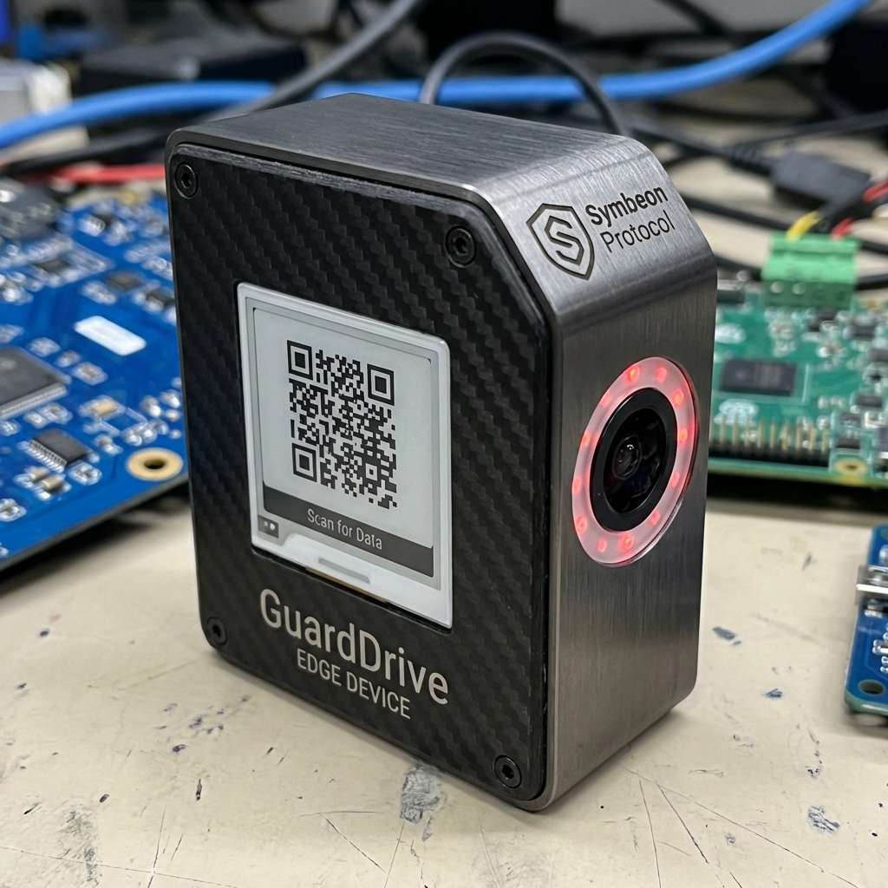

# 🚔 GuardDrive: Inviolable Vehicle Forensics

> **Sovereign Infrastructure for Urban Security & Smart City Governance**


## 👁️ The Vision
**GuardDrive** is a biocybernetic innovation project designed to transform standard vehicle telemetry into an absolute, cryptographically signed stream of forensic evidence. 

By merging **IoT Edge Computing** with **Hybrid Blockchain Architecture**, GuardDrive creates an immutable "Digital Witness" for every vehicle, ensuring transparency for drivers, truth for authorities, and high-fidelity data for insurers.

---

## ⚡ Core Pillars (Trinity Protocol)

### 1. Forensic Telemetry (OPPORTUNITY)
Real-time tracking of speed, G-force, and inertial patterns. Unlike standard trackers, GuardDrive detects impact vectors and collision angles with scientific precision.

### 2. IP Lockdown (VALIDATION)
All telemetry data is signed locally via a **Secure Element (STM32)** before transmission. This ensures that the data remains sovereign and untamperable even if the communication network is compromised.

### 3. Smart City Infrastructure (AUTHORITY)
Featuring a dynamic **E-ink QR Display** and **Infrared Status LEDs**, GuardDrive allows traffic authorities and smart city towers to scan a vehicle's "Identity NFT" and insurance status in real-time, 24/7.

---

## 🎨 Visual Identity

| **Forensic View Dashboard** | **Edge Device Concept** |
| :---: | :---: |
|  |  |


---

## 🛠️ Tech Stack
- **Framework**: [Next.js 14](https://nextjs.org/) (App Router)
- **Styling**: TailwindCSS (Biocybernetic Theme)
- **Animations**: Framer Motion
- **Icons**: Lucide React
- **Core Protocol**: Symbeon L1 Architecture

## 🚀 Getting Started

```bash
# Clone the repository
git clone https://github.com/th3m1s-core/guarddrive-pilot.git

# Install dependencies
npm install

# Run the Simulator
npm run dev
```

---

## ⚖️ Governance
This project is part of the **TrinityOS Ecosystem** and follows the **IP Lockdown Governance** rules. All proprietary logic related to the Symbeon Validator remains in Layer 1.

**Project Lead**: [João / SH1W4](https://github.com/SH1W4)  
**Status**: `ORBITAL_LAUNCH` (Pilot Phase)
